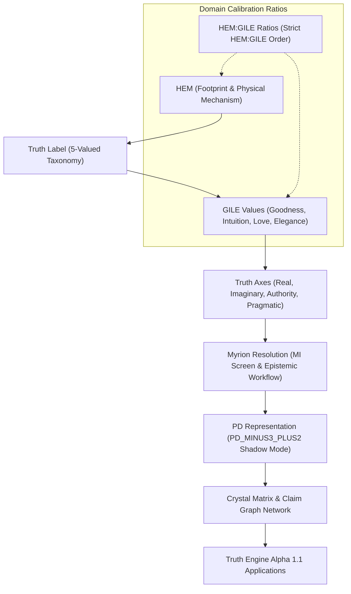

# TI Sigma Architecture Dependency Graph

## Architectural Control Flow & Rules
1. **HEM:GILE Ordering**: Always written as `HEM:GILE` (Existence first).
2. **PD Shadow Isolation**: Potentiality Deficit (PD) runs in shadow-only mode without mutating primary Truth Engine evaluation output.
3. **5-Valued Label Taxonomy**: Primary classification layer evaluated before GILE vector calculation.
